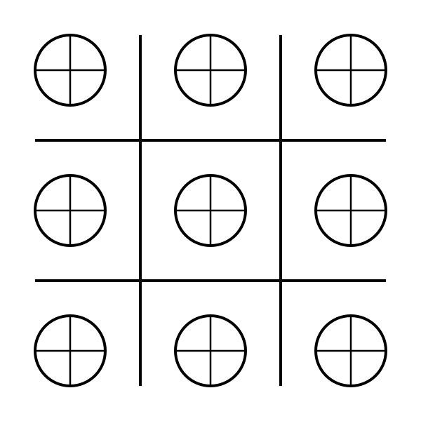

<!-- logo image of "microCHSys" -->
<h1></h1>

# microCHSys
Tool to extract contour from a image using micro Convex Hull System (microCHSys).
___
GitHub: https://github.com/YujiSODE/microCHSys  
>Copyright (c) 2023-2025 Yuji SODE \<yuji.sode@gmail.com\>  
>This software is released under the MIT License.  
>See LICENSE or http://opensource.org/licenses/mit-license.php  
______

## [Algorithm](algorithm_microCHSys.md)

<b>Figure 1.</b> Image to show the algorithm in APNG.

