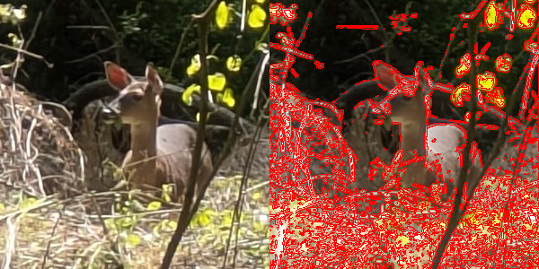
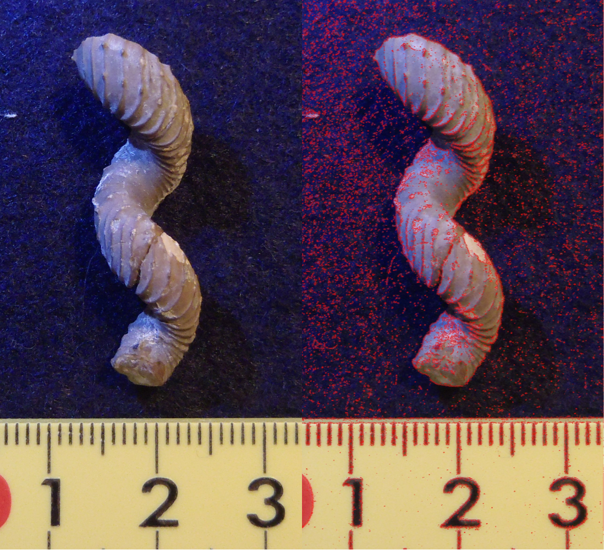

<!-- logo image of "microCHSys" -->
<h1></h1>

# microCHSys
Tool to extract contour from a image using micro Convex Hull System (microCHSys).
___
GitHub: https://github.com/YujiSODE/microCHSys  
>Copyright (c) 2023-2025 Yuji SODE \<yuji.sode@gmail.com\>  
>This software is released under the MIT License.  
>See LICENSE or http://opensource.org/licenses/mit-license.php  
______

## [Algorithm](algorithm_microCHSys.md)

<b>Figure 1.</b> Image to show the algorithm in APNG.

## Scripts
### Main script
- [`microCHSys.js`](microCHSys.js)

### GUI
- [`index.html`](index.html): GUI

## Compatibility
- Firefox `137.0.2+` (64-bit)
- Firefox `98.0.1+` (64-bit)

## Samples

<b>Figure 2.</b> Sample image to show a result with a deer.

<b>Figure 3.</b> Sample image to show a result with a _Hyphantoceras_ _orientale_ (Sode, 2019).

## Reference
- Sode, Y. 2019. HyphantocerasOrientale_20191128_1a.JPG. YSCollection07_18. https://github.com/YujiSODE/YSCollection07_18

