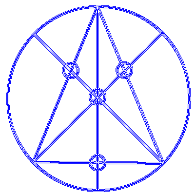

<!-- logo image of "microCHSys" -->
<h1></h1>

# microCHSys/algorithm_microCHSys.md
Algorithm for micro Convex Hull System (micro C. H. Sys.).
___
GitHub: https://github.com/YujiSODE/microCHSys  
>Copyright (c) 2023 Yuji SODE \<yuji.sode@gmail.com\>  
>This software is released under the MIT License.  
>See LICENSE or http://opensource.org/licenses/mit-license.php  
______
## micro Convex Hull System (micro C. H. Sys.)

Moore neighborhood: c0 and c1 to c8.
```
 [c1|c2|c3]
 [c4|c0|c5]
 [c6|c7|c8]
```

8-bit patterns in the micro Convex Hull system, when c0 is in a convex hull excluding its apices.
```
[when c0 = 1 and  linear]
B = B129       B = B66        B = B36        B = B24
B: 0b10000001, B: 0b01000010, B: 0b00100100, B: 0b00011000
100__________  010__________  001__________  000__________
010__________, 010__________, 010__________, 111__________
001__________  010__________  100__________  000__________

[when c0 = 1 and nonlinear]
B = B162       B = B140       B = B69        B = B49
B: 0b10100010, B: 0b10001100, B: 0b01000101, B: 0b00110001
101__________  100__________  010__________  001__________
010__________, 011__________, 010__________, 110__________,
010__________  100__________  101__________  001__________

B = B81        B = B76        B = B138       B = B50
B: 0b01010001, B: 0b01001100, B: 0b10001010, B: 0b00110010
010__________  010__________  100__________  001__________
110__________, 011__________, 011__________, 110__________
001__________  100__________  010__________  010__________

[when c0 = 1 and areal]
B = B0
B: 0b00000000
000__________
010__________
000__________
```
#
```
B = c0;
ifB = B&B129^B129&&B&B66^B66&&B&B36^B36&&B&B24^B24&&B&B162^B162&&B&B140^B140&&B&B69^B69&&B&B49^B49&&B&B81^B81&&B&B76^B76&&B&B138^B138&&B&B50^B50&&B^B0;
if (ifB > 0) {
	/* a given cell is not in the convex hull */
	B = 1;
} else {
	/*a given cell is in the convex hull */
	B = 0;
}
```

